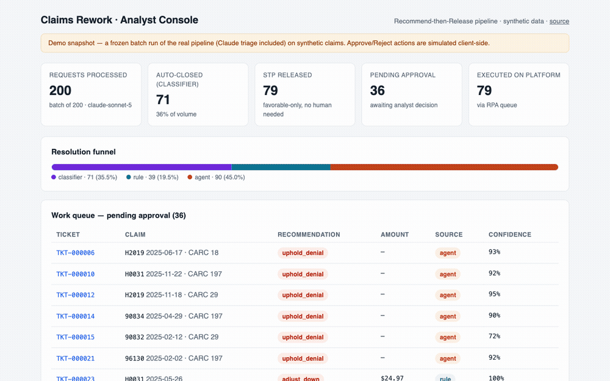
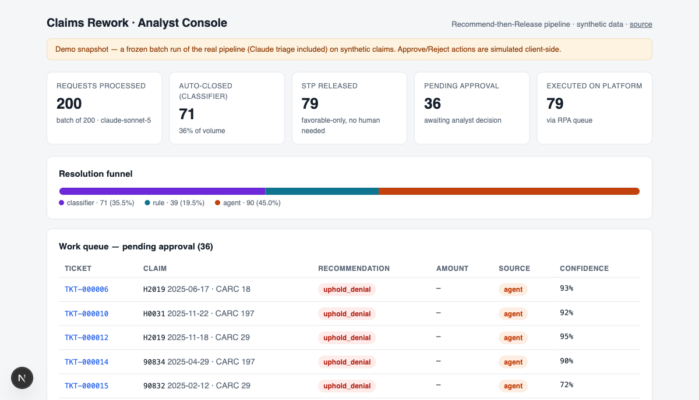

# claims-rework-agent

**Recommend-then-Release: a human-in-the-loop agentic pipeline for healthcare claims rework — LangGraph + Claude + XGBoost, on fully synthetic data.**

[](https://github.com/uv060390/claims-rework-agent/actions/workflows/ci.yml)
&nbsp;**[▶ Live analyst console](https://claims-rework-console.vercel.app)** · [Eval report](docs/eval-report.md) · [Agent design contract](AGENTS.md) · [Model card](docs/model-card.md)



A public reimplementation of the architecture behind a production claims-rework automation
system I designed and shipped at a Fortune-500 healthcare company — rebuilt end-to-end on
synthetic data so every layer is inspectable and runnable. In production, the original
system auto-resolves 25% of rework volume for a 120-FTE operation handling ~100K
adjustments/month. All data and metrics **in this repo** are synthetic/simulated.

## The numbers (all reproducible offline — see the [eval report](docs/eval-report.md))

| | |
|---|---|
| Resolution funnel (5,000-request golden set) | **22.3%** classifier auto-close · **32.2%** deterministic rules · **45.5%** LLM triage |
| NAN classifier (held-out provider split) | PR-AUC **0.989** · **99.1%** precision at threshold |
| Rules engine | **100%** action & amount precision (CI-gated) at 32.2% coverage |
| Claude triage agent (45 recorded traces) | **93.3%** action accuracy · **100%** exact adjustment amounts |
| Unsafe errors (favorable rec on unfavorable truth) | **0** — a CI hard-fail gate |
| Hallucinated identifiers/amounts in rationales | **0** — deterministic check, CI hard-fail |

## How it works

Cheap deterministic layers run first; the LLM only reasons over cases they can't resolve.
Irreversible outcomes always require a human.

```
Rework request (synthetic)
   │
   ▼
[1] XGBoost "No-Adjustment-Needed" classifier ──► confident no-change? → auto-close
   │
   ▼
[2] Deterministic rules engine ──► clear-cut case? → recommendation without LLM
   │
   ▼
[3] LangGraph + Claude triage agent ──► {action, amount, rationale, confidence}
   │
   ▼
[4] Recommendation posted to ticketing system (mock)
   │
   ├── favorable to provider ──► straight-through: released to execution queue
   └── unfavorable (denial / recoupment) ──► analyst Approve required (console)
   │
   ▼
[5] RPA execution queue (mock) ──► executes against claims platform (mock)
   │
   ▼
[6] Append-only audit ledger — every decision, by every layer
```

Design decisions worth reading:

- **Classifier → rules → agent ordering** keeps LLM spend proportional to genuine
  ambiguity, not raw volume.
- **The STP gate lives in the orchestrator, not the agent** — favorability is recomputed
  from the recommended *action* itself, so no layer (least of all the LLM) can label its
  own output safe for auto-release. Denials and recoupments always park for a human.
- **The agent terminates by calling a tool** (`submit_recommendation`), so its output
  arrives structured and validated; failure to submit falls back to `route_specialist`
  at low confidence — non-executable, guaranteed to land with a human.
- **Honest system boundaries**: the ticketing system, RPA queue, and claims platform are
  in-repo FastAPI mocks with realistic API contracts, so the integration architecture is
  real even though the vendors aren't.
- **Append-only ledger**: any outcome is reconstructable from `pipeline_events` alone.
- **Errors are absorbed by architecture, not just minimized**: every recorded agent miss
  errs in the unfavorable direction and therefore waits for an analyst instead of
  releasing money.

## Two debug stories the evals caught

1. **A retrieval bug, not a reasoning bug** — early duplicate-hunt failures traced to a
   provider-history tool silently truncating at 25 rows: the agent reasoned correctly on
   incomplete evidence and recommended favorable reprocessing on true duplicates. Adding
   member/date/code search filters took that scenario from 1/5 to 5/5.
2. **The LLM judge caught systematic overclaiming** — the agent stated requester
   assertions ("auth approved for this member") as verified facts no tool could verify.
   One epistemic-precision prompt requirement later: action accuracy 91.1%→93.3%,
   judge-grounded 73%→89%. Then the judge itself was audited — several residual flags
   were judge over-strictness, not agent errors. Full story in the
   [eval report](docs/eval-report.md).

## The analyst console

**Live: https://claims-rework-console.vercel.app** — a frozen batch of 200 requests run
through the real pipeline (Claude triage included): work queue, per-ticket recommendation
with rationale and layer provenance, the original request note, the append-only audit
trail, and one-click Approve & release. The deployment is a static snapshot (no backend,
no API key); point `NEXT_PUBLIC_GATEWAY_URL` at `pipeline/gateway.py` for live mode.

[](https://claims-rework-console.vercel.app)

## Quickstart

```bash
uv sync
uv run pytest                                # 65 tests, no API key needed
docker compose up --build                    # claims platform :8001 · ticketing :8002 · RPA queue :8003 · Postgres :5432
```

Everything agentic is replayable offline: 45 recorded Claude traces in `evals/traces/`
power the evals and CI. To run the live agent, set `ANTHROPIC_API_KEY`.

```bash
uv run python data/generate_rework.py --n-requests 5000 --seed 42 --out data/demo   # regenerate dataset
uv run python -m pipeline.classifier.train                                          # retrain classifier
uv run python -m evals.record_traces --per-scenario 5                               # re-record agent traces (API key)
uv run python -m evals.judge                                                        # LLM-judge groundedness (API key)
uv run python -m evals.report                                                       # regenerate docs/eval-report.md
uv run python -m evals.run_batch --n 200 --out dashboard/lib/demo-snapshot.json     # rebuild console snapshot (API key)
```

## Repo map

```
pipeline/    orchestrator + STP gate · LangGraph agent · XGBoost classifier · YAML rules · ledger · gateway
mocks/       FastAPI stand-ins: claims platform, ticketing system, RPA execution queue
data/        deterministic synthetic generator + frozen 5,000-request golden set (13 scenarios)
evals/       harness · LLM judge · trace recorder · batch runner · committed traces
dashboard/   Next.js analyst console (Vercel)
docs/        data dictionary · model card · eval report · screenshots
tests/       65 tests incl. STP-safety and groundedness CI hard-gates
```

Built phase-by-phase with CI green at every step — the commit history *is* the build log.

## License

MIT
